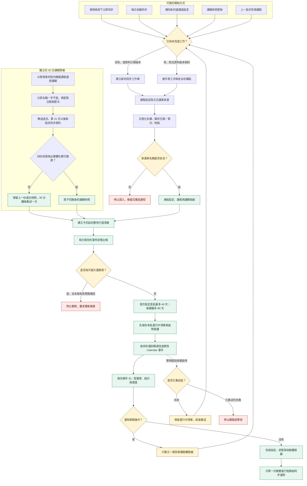

# T-SCHOOL Schedule Sync 同步機制說明

這套機制的核心做法是：先整理出「日曆應該有什麼」，再和上次安全存檔比較，只處理今天起真正需要改變的事件；若事件很多，就拆成多批，每批完成後存檔，因此中途逾時也能接著做。

如果你想知道程式如何避免重複行程、保存進度與處理失敗，可以從這份較完整的說明繼續閱讀。

## 為什麼不能一次把全部事件寫完

114-2 高二資料的實際測試結果如下：

| 測試內容 | 筆數 | 第一次寫入 | 第二次同步驗證 |
|---|---:|---:|---:|
| 小量測試 | 10 | 11.3 秒 | 通過 |
| 小量測試 | 25 | 22.5 秒 | 5.4 秒 |
| 中量測試 | 50 | 36.3 秒 | 14.1 秒 |
| 中量測試 | 100 | 88.4 秒 | 22.0 秒 |
| 大量測試 | 200 | 162.1 秒 | 57.1 秒 |
| 完整資料 | 422 | 362.5 秒 | 107.6 秒 |

422 筆雖然最後成功，而且第二次同步找到 422 筆、沒有遺失、重複或多餘修改，但第一次寫入已經沒有足夠的安全餘裕。內部計時是 362.5 秒；Apps Script 執行頁記錄的完整呼叫則是 413.381 秒，第二次驗證也記錄到 273.124 秒。兩種數字範圍不同，但都顯示單次完整處理太接近危險邊界。

Google 目前公布的 Apps Script 單次執行限制是 6 分鐘；配額可能隨時調整，應以 [官方配額表](https://developers.google.com/apps-script/guides/services/quotas) 為準。正式同步還要下載課表、整理資料、讀寫狀態、檢查安全條件與寄信，因此不能把測試中「剛好完成」當成穩定保證。

因此正式機制採用：

- 首次設定的第一批最多 40 次 Calendar 操作，後續每批最多 80 次。
- 每批另設 150 秒的軟性時間上限；即使未滿該批上限，時間先到也會先存檔。
- 尚未完成時，約一分鐘後由唯一的背景觸發器接著做。
- 422 筆首次同步在未觸發 150 秒軟上限時約 6 批；每一批仍保留安全時間與可續傳存檔點。
- 日常同步只處理異動，沒有變化的事件不呼叫 Calendar，因此通常一批就能完成。
- 完整逐筆讀回 422 筆的驗證只用於測試或強制修復，不放進每次日常同步。

## 整體視覺化邏輯圖



可以把整套系統想成「有條碼的圖書館盤點」：

- 課表是館藏清單。
- Google Calendar 是書架。
- 同步識別碼是每本書的條碼。
- 內容簽章像版本號。
- 每批只盤點一小區，完成就保存進度。
- 即使中途停電，也從上一個存檔點繼續，而不是重新搬完整座圖書館。

## 1. 先取得可信的課表

系統只使用程式設定的正式 Apps Script `/exec` 課表端點，不保存重新導向後帶有權杖的網址。

取得資料後，程式會先解析並檢查：

- 是否為預期年級。
- 是否有足夠的日期與週次。
- 日期能否安全判定年份。
- 每一節的開始與結束時間是否存在。
- 課程格、跨節格與全天備註是否可解析。
- 課表日期是否和現在相距過遠。
- 是否出現同一事件身分、但內容互相衝突的資料。

只要核心結構不可信，這次同步就不寫入 Calendar。這能避免「來源暫時只載到一半」被誤認為大量停課。

來源指紋會包含排序後每一筆事件的：

- 原始標題。
- 課程或活動。
- 日期。
- 起訖節次。
- 起訖時間。
- 地點。
- 全天與否。

因此不只是「課程名稱清單相同」就算同一版本；調課、換教室或時間改變也會產生新的來源指紋。

## 2. 如何整理課程與活動

每一筆來源資料會被整理成：

- 原始課程名稱。
- 課程或活動類型。
- 日期、星期與週次。
- 起訖節次。
- 起訖時間。
- 地點。
- 是否為全天事件。
- 來源更新標籤。

例如：

```text
地理 [協作坊]
```

會拆成：

```text
標題：地理
Calendar 地點：協作坊
```

活動採兩層規則辨識：

1. 名稱符合明確活動關鍵字，例如全校活動、模擬考、防災演練等。
2. 即使沒有活動關鍵字，只要同一正規化名稱在整份課表中合計少於 5 個同步節數，也判定為活動。跨節儲存格依實際跨節數累計；剛好 5 節仍視為課程。

這個節數邊界是為了攔下名稱未知的單次講座或短期活動，不會因為名稱不在選課字典中就直接猜成活動。

來源有明確日期、但沒有時間的活動，會建立為全天事件；程式不自行捏造時間。

## 3. 如何套用使用者的選擇

### 3.1 一般課程

只有使用者選取的課程會加入應有行程清單。

### 3.2 活動

活動採「預設加入、可以排除」：

- 可排除單一活動。
- 可關閉所有活動。
- 關閉所有活動後，新出現的活動也不會自行加入。

### 3.3 新名稱

完成首次設定後，如果來源突然出現以前沒有的標題：

- 系統先把它加入「待確認」。
- 先保留可能重要的行程。
- 使用者可在控制臺選擇保留或排除。
- 排除後，相同身分名稱的未來受管理事件才會移除。

## 4. 名稱防呆分成兩個等級

### 4.1 一般課表與選課：容忍無意義格式差異

身分名稱會進行：

- Unicode NFKC 統一。
- 移除零寬字元。
- 全形空白轉為一般空白。
- 合併多餘空白。
- 比對時忽略空白。
- 英文字母統一小寫。
- 統一可安全轉換的全形括號等字元。

因此下列名稱不會因為誤多打一個空格而漏掉：

```text
國語文
 國 語文　
```

儲存設定時，程式會把使用者看到的名稱重新對回來源中的正式顯示名稱，不把含多餘空格的版本永久保存。

如果兩筆資料得到同一事件身分，而且內容完全相同，只保留一筆；若身分相同但時間、類型或課綱版本互相衝突，就停止同步並要求檢查，不會任選其中一筆。

### 4.2 課綱分頁：必須一字不差

課綱有意採更嚴格規則：

1. 先用課表原始課程名稱，一字不差對應 Google Sheet 分頁名稱。
2. 再以日期與起訖節次配對。
3. 不使用分頁內的「中文名稱」。
4. 不使用模糊比對自動猜測。

如果精確分頁不存在，但發現一個只差空格或全形字元的分頁，狀態會顯示：

```text
疑似只差空格或全形字元：國語文 → 國語文[結尾空格]
```

這只是診斷，不會自動套用。課綱配錯課比暫時沒有課綱更危險。

含「跨校」的課程會列入「已略過跨校課程」，不當成課綱缺頁錯誤；基本課表事件仍可照常同步。

## 5. 只主動管理今天與未來

每次差異同步只處理今天起的事件。

已經過去的 Calendar 事件：

- 不因課表來源改變而刪除。
- 不重新套用格式。
- 不因換學期而清空。
- 切換專用 Calendar 時也不搬移或刪除。

為避免 Apps Script 專案儲存空間持續膨脹，超過 120 天的「內部同步索引」會移除，但 Calendar 上的歷史事件仍原封不動保留。也就是丟掉舊書的盤點卡，不是把書從書架移除。

## 6. 30 日課綱同步

課綱與基本課表採兩條獨立管線，避免一次執行同時承擔大量 Calendar 寫入與四份 Sheets 讀取。

### 6.1 何時才讀課綱

同時符合下列條件才會讀取：

- 該年級已有課綱來源組。
- 課程日期落在來源組的適用期間。
- 已完成第一次基本同步。
- 自動同步未暫停。
- 是使用者已選課程。
- 是今天到第 30 天內的課程，包含今天與第 30 天。
- 不是純非同步列。

來源組由中央 Google Sheet 的 `課綱來源` 分頁提供。程式依欄名尋找 `啟用`、`來源組鍵`、`課綱名稱`、`年級`、`適用起日`、`適用迄日`、`課綱試算表連結`，不依賴欄位位置；`備註` 只供人工閱讀。同一 `來源組鍵` 的多列會合併為一組，且必須使用相同年級與適用日期。

目前只有「114-2 高二」啟用四份來源。未來新增課綱時，只需在中央索引增加新的年級、來源組鍵、適用起訖日與 Sheets 連結；舊的 `Code.gs` 會自行取得更新。索引成功讀取後保存最後成功版本，暫時失敗時不會立刻失去課綱；從未成功時才使用內建 114-2 高二來源。舊課綱不會只因月份剛好相同而誤用到新學期。

### 6.2 欄位可以換位置

程式依欄位名稱尋找：

- `日期`
- `節次`
- `實體課程教室`
- `單元主題`
- `課程內容`

因此校方可以調換欄位順序或增加其他欄位。必要名稱消失時，該次快照失敗，不用錯誤的欄位位置硬讀。

### 6.3 非同步與混合式課程

- 只有非同步時數的列：略過。
- 同時有實體或線上同步時數的混合列：保留。
- 已過去的列：不讀。
- 第 31 天以後：基本事件存在，但當次不讀課綱。

### 6.4 課綱寫到哪裡

課表地點與課綱中的 `實體課程教室` 會去重後以 `-` 組合，同時寫入標題右側的方括號與 Calendar 地點，例如：

```text
國語文 [吉林基地-協作坊]
Calendar 地點：吉林基地-協作坊
```

標準說明以 HTML `<br>` 寫入段落內換行，並依有值的欄位顯示粗體單元主題與課程內容：

```text
第 23 週 / 週五 / 第 1 節

# 單元主題
第一冊

# 課程內容
核心選文講解……


[T-SCHOOL Schedule Sync]
＊部分資訊來自課綱，請以教師最新說明為主
```

說明格式只保留標準與進階自訂；進階自訂預先帶入標準模板。老師只修改課綱時，程式會更新標題、地點與說明，但不把它列為「行程調整」寄信。

### 6.5 最後成功快照

四份來源讀完後，新資料先寫到暫存版本，重新讀回驗證成功才切換 active pointer：

- 新快照失敗時，上一份成功快照仍可使用。
- 從未成功時，基本課表照常同步，只是不附課綱。
- 第一次失敗約 30 分鐘後重試。
- 第二次仍失敗才寄信。
- 課綱工作硬逾時時，由獨立的逾時保護工作轉入相同重試流程。

## 7. 每個事件的兩種識別資訊

### 7.1 同步識別碼：回答「這是哪一堂」

事件身分由下列資料組成：

- 正規化後的課程名稱。
- 日期。
- 全天或起訖節次。
- 正規化後的地點。

身分經雜湊後，會寫入 `CalendarEvent` 的隱藏標籤：

```text
tschool_managed = 1
tschool_sync_id = ……
tschool_meta_version = 2
```

所有更新與刪除都先驗證隱藏管理標籤。舊版說明欄中的管理標記與識別碼只用於遷移，套用新版後不再顯示。

### 7.2 內容簽章：回答「內容有沒有變」

短簽章涵蓋：

- 標題與類型。
- 全天與否。
- 日期、節次與起訖時間。
- 地點。
- 說明格式。
- 提醒方式與分鐘數。
- 課綱內容版本。

來源的「更新時間文字」不放入簽章，避免校方只更新時間標籤就造成幾百次 Calendar 寫入。

舊版曾保存完整 JSON 長字串。新版改存固定長度短雜湊，並能辨識舊簽章；部署新版後不會只因儲存格式改變，就把 422 筆全部重寫。

## 8. 如何判斷新增、更新、調整與取消

| 比對情況 | 動作 |
|---|---|
| 身分與內容簽章都相同 | 完全不讀寫 Calendar 事件 |
| 身分相同、內容不同 | 更新原事件 |
| 只有課綱 hash 不同 | 只更新說明 |
| 新來源有、舊狀態沒有 | 依同步識別碼確認後新增 |
| 舊狀態有、新來源沒有 | 通過刪除安全檢查後取消 |
| 同名事件在 21 天內有唯一最近候選 | 視為調課並更新原事件 |
| 有兩個距離一樣合理的候選 | 不猜測；分開視為新增與取消 |

一般同步若簽章未變，就不讀寫該 Calendar 事件。因此使用者自己做的非來源修改，不會每天被無故覆蓋；「強制修復」才會逐筆驗證來源管理欄位。

## 9. 同步工作單與版本凍結

每次完整同步都有工作編號，保存：

- 年級與學期。
- 目標 Calendar ID。
- 設定指紋。
- 完整課表指紋。
- 有效課綱快照版本。
- 應有事件指紋。
- 初始操作數與已完成數。
- 新增、更新、課綱更新、刪除統計。
- 最多前 100 項精簡異動明細。
- 目前正在執行的批次（`inFlight`）。
- 最近執行時間與下一次續跑時間。
- 是否已認領完成通知。

續跑前會重新取得來源並比對指紋：

- 全部相同：接著原工作做。
- 選課、課表、Calendar 或課綱已變：舊工作標記為被取代，從已成功保存的事件狀態重新規劃。

新工作不盲目沿用舊操作清單，所以不會讓前半批使用舊課表、後半批使用新課表。

## 10. 每一批實際怎麼做

每批流程固定為：

1. 取得 Script Lock，確保同時只有一個寫入者。
2. 讀取現有工作單；若是背景續跑，先保存新的心跳並建立逾時保護工作。
3. 重新驗證設定、課表與課綱版本。
4. 用目前已提交狀態重算剩餘差異。
5. 首次設定的第一批選出最多 40 次操作，後續批次選出最多 80 次。
6. 先把本批操作保存為 `inFlight`。
7. 建立逾時保護工作。
8. 依序更新、建立，最後才刪除。
9. 保存新的事件 ID 與狀態。
10. 保存統計並清除已完成的 `inFlight`。
11. 若仍有工作，只建立一個續跑觸發器。

批次操作上限與 150 秒兩項限制，任何一項先到就停止本批。

## 11. 最危險中斷點如何防重

最危險的情況是：

1. Calendar 已成功建立事件。
2. Apps Script 立刻逾時。
3. 新事件 ID 尚未寫回狀態。
4. 下一次誤以為事件不存在。

新版在所有建立操作前，會先以事件日期範圍與隱藏同步標籤查找：

- 找到 0 筆：建立。
- 找到 1 筆：接回該事件 ID，不再建立，並重新套用提醒設定。
- 找到 2 筆以上：停止，不建立第三筆。

若事件剛建立但還來不及寫入隱藏標籤，下一次只會接回標題、時間、地點與說明完全相同的唯一事件；若有兩筆候選則停止。

更新與刪除也是可重複執行的：

- 更新已完成但未存檔：下一次再套用同樣內容，結果不變。
- 調課已換成新的識別碼但未存檔：舊、新識別碼都能驗證，續跑不會誤判。
- 刪除目標已不存在：視為已刪除，不再次失敗。
- 事件仍存在但管理標記不符：保留事件並停止。

這種「執行第二次仍得到同一結果」的性質稱為冪等。

## 12. 寫入順序與刪除安全

一般差異處理順序是：

1. 更新或調整仍應存在的事件。
2. 建立缺少的事件。
3. 保存前面結果。
4. 最後才刪除取消事件。

因此中途失敗時，系統偏向暫時多留舊事件，而不是先把重要行程清空。

自動同步與強制修復若同時符合：

- 未來事件至少要刪除 5 筆。
- 超過目前受管理未來事件的 40%。

就會停止。比例的分母只計未來事件，不讓大量歷史資料稀釋風險。

設定變更可通過安全預覽確認。預覽會產生一個和當次設定、來源及刪除清單綁定的確認 token，真正寫入前以最新來源重算：

- 確認碼仍相符：允許使用者剛確認的大量選課變更。
- 來源或設定已變：token 失效，重新停止並要求預覽。

強制修復沒有這個預覽 token，因此不能繞過大量刪除保護。

## 13. 切換專用 Calendar

Calendar 搬移也使用同一工作單：

1. 保存舊 Calendar ID。
2. 在新 Calendar 分批建立或更新所有未來應有事件。
3. 確認新 Calendar 的未來事件完成。
4. 再分批清理舊 Calendar 中可驗證的受管理未來事件。
5. 最後才清除搬移狀態。

過去事件不搬、不刪，私人事件也不碰。若搬移中斷，下一批仍保有舊 Calendar ID 與清理游標。

在這項清理完成前，控制臺拒絕再次切換到第三個 Calendar；否則第一個舊 Calendar 的剩餘事件可能失去可追蹤的清理來源。

## 14. 同時觸發如何處理

手動同步、每日同步、課綱套用與背景續跑可能碰在一起。系統用兩層保護：

- Script Lock：同一瞬間只准一個執行者操作。
- Active job：同一份程式只有一張有效工作單。

設定儲存也使用同一把 Script Lock。即使同時開兩個控制臺分頁，也不能在某一批仍寫 Calendar 時清掉其工作單。

另一個呼叫若發現工作正在進行：

- 不另開平行工作。
- 回傳目前工作編號與進度。
- 確認至少有一個續跑觸發器。

背景觸發器本身開始後會先移除舊的同名單次觸發器，再視需要建立下一個，避免越積越多。

## 15. 暫時失敗、硬逾時與通知

### 15.1 暫時性失敗

例如 Google Calendar 短期流量限制、Sheets 暫時無回應：

1. 保留工作單與 `inFlight`。
2. 延後約兩分鐘重試一次。
3. 重試仍失敗才停止並寄信。

### 15.2 硬逾時

每批開始會建立逾時保護工作：

- 工作超過預期時間且沒有成功存檔：安排一次安全續跑。
- 下一次仍在相同事故中硬逾時：停止並寄信。
- 逾時保護工作拿不到鎖：延後再檢查，不和仍在工作的批次搶寫。

批次保存與建立續跑觸發器之間，逾時保護工作會一直保留；確認續跑觸發器存在後才移除，避免工作卡在「有進度、沒人接手」的狀態。

### 15.3 不應盲目重試的錯誤

下列問題會立即停止：

- 新學期尚未重新選課。
- 主要 Calendar 或非本人擁有的 Calendar。
- 名稱／事件身分碰撞。
- 多筆相同同步識別碼。
- 管理標記被移除。
- 可疑大量刪除。
- Apps Script 專案儲存空間接近安全容量。

這些問題不是多試一次就會自己消失，盲目重試反而危險。

### 15.4 通知只在完整完成後處理

- 第一次同步會先以獨立 Apps Script 執行預讀未來 30 天課綱；60 秒內完成時第一批事件直接帶入課綱，超時或失敗則不占用 Calendar 寫入批次，改由背景工作補上。
- 首次設定通知只寄一次：行程較多時，在至少 40 次 Calendar 操作安全保存後寄送「行程同步設定完成｜T-SCHOOL Schedule Sync」，並說明其餘事件會在背景分批繼續；行程較少而直接完成時，則在全部基本行程寫入後寄送。背景批次全部完成後不再重複寄信。
- 來源異動摘要只在整份工作完成後寄一次。
- 純課綱說明更新不列入行程調整信。
- 「行程同步設定完成」信只寄一次；課綱是否已帶入仍以控制臺的課綱更新狀態為準。
- 異動明細最多列前 100 項，其餘顯示省略數量，避免狀態與 Email 過大。
- 寄信失敗不會把已成功的 Calendar 寫入回報成失敗。

程式在寄信前先認領通知，以避免 finalizer 重跑時重複寄送。代價是：若剛認領就發生極少見的硬中斷，該封信可能沒有送出；Calendar 與同步狀態仍不受影響。

## 16. 新學期處理

若課表的學期識別改變：

- 暫停自動同步。
- 保留現有 Calendar 事件。
- 清除本學期選課。
- 以學期識別寄送一次需要處理通知；寄送失敗會在約 30 分鐘後重試一次。
- 在側欄持續顯示警示，且未選任何課程前不可儲存或執行同步。
- 等使用者開啟控制臺重新選課；儲存時預設恢復轉換前的自動同步偏好。

程式不會把「新學期課表沒有舊課程」直接解讀成要刪除整個舊學期。

## 17. Apps Script 專案儲存空間容量保護

狀態可能包含數百筆事件、課綱快照與工作單，因此採取：

- 大型 JSON 依 UTF-8 位元組分塊保存；每塊最多 7,500 bytes，低於 Google 目前每個 Property 9 KB 的限制。
- 每筆事件只保存短簽章，不重複保存長 JSON。
- `inFlight` 首批最多 40 筆，後續最多 80 筆。
- 異動明細最多 100 筆，而且只保存通知需要的精簡欄位。
- 超過 120 天的歷史索引自動丟棄，Calendar 歷史不受影響。
- 寫入前估算 UTF-8 容量。
- 估計超過 430 KiB 時停止，不冒險破壞狀態。
- 課綱使用版本化暫存與 active pointer，驗證成功才切換。

Google 的 Properties 限制可能調整，正式數值以 [Apps Script 官方配額表](https://developers.google.com/apps-script/guides/services/quotas) 為準。

## 18. 側邊欄會顯示什麼

同步進行時，側欄顯示：

```text
同步進度：58%
本批已安全保存，等待下一批建立或更新行程。
```

設計行為：

- 第一批安全保存後，使用者可以關閉側欄。
- 關閉側欄不會停止背景觸發器。
- 重新開啟時會讀 active job，而不是誤顯示舊的「100% 完成」。
- 輪詢只有在完成或錯誤狀態的 job ID 與本次工作相同時才結束，避免 Apps Script 冷啟動期間誤讀上一輪結果。
- 執行中約每 2.5 秒更新；等待下一批或重試時約每 8 秒更新，避免大量無意義查詢。
- 只有進度狀態真正變成 `complete`，才顯示同步完成並重新載入設定。

第一次同步若有 422 筆，可能需 10–20 分鐘；日常沒有大量變化時通常快很多。

## 19. 多人同時使用

每位使用者會用自己的校內帳號與自己的 Apps Script、Calendar 及專案儲存空間執行，因此多人同時使用時，不會把所有 Calendar 寫入集中在同一個中繼帳號。

共同資源主要是：

- T-SCHOOL 課表來源。
- 校方四份課綱 Sheets。
- Google 服務整體調度。

降低尖峰的方式包括：

- 課表偵測與 Calendar 同步固定於每日 03:00、11:00、18:00、21:00，使用 `atHour(hour).nearMinute(0)`；依 [Apps Script 官方觸發器說明](https://developers.google.com/apps-script/reference/script/clock-trigger-builder#nearMinute(Integer))，Google 會在各整點前後約 15 分鐘啟動。即時通知預設開啟：偵測到異動並完整套用 Calendar 後立即嘗試寄出，每日摘要觸發器固定 06:00。關閉後，使用者自訂時間才會建立只負責寄信的排程；異動會持續保存，後續零異動同步不會清除，直到寄送成功。
- 課綱每日更新仍只指定小時、不固定分鐘，讓共用課綱的讀取分散在完整一小時內，避免所有使用者集中於整點。
- 課綱每日只讀一次，不綁在每次 Calendar 同步。
- 每位使用者的日常 Calendar 同步只寫異動。
- 暫時錯誤不立即密集重試。
- 每個背景工作只保留一個續跑觸發器。

## 20. 已加入的自動驗證

目前本機 smoke test 已涵蓋：

- 422 筆以首批 40 筆、後續每批最多 80 筆，共 6 批完成。
- 422 筆強制修復也在 6 批停止，不會無限重跑。
- 第二次無變更同步為零 Calendar 操作。
- Calendar 已建立、但狀態未保存時，續跑不建立第二筆。
- Calendar 已建立、但提醒尚未成功時，續跑會接回同一筆並重套提醒。
- 隱藏同步識別碼已重複時，不建立第三筆。
- 調課的隱藏標籤已改成新值、但尚未存檔時可續跑。
- 事件隱藏管理標籤被移除時不更新。
- 標題與地點會正確合併課表地點及實體課程教室，且不產生重複值或多餘連字號。
- 標準說明使用 HTML 粗體與 `<br>`，不顯示技術管理標記或同步識別碼。
- 舊版簡潔／詳細設定遷移為標準；進階自訂以標準模板為基礎。
- 名稱多半形、全形或零寬空白時可安全對應。
- 身分相同但內容衝突時停止。
- 舊版長簽章可辨識，並逐批遷移隱藏標籤與新版呈現格式。
- 建立新 Calendar 時保留舊 Calendar ID。
- 上一輪 Calendar 搬移完成前不能再次切換目標。
- 零操作的 finalizer 第二次失敗仍會正確停止並通知，不會無限重試。
- 第一次硬逾時安排重試；連續第二次硬逾時停止並寄信。
- 課綱欄位換序、跨節、`56` 節次與混合式／純非同步判斷。
- 課綱只差空格時只提示、不自動配對。
- 跨校課程不列入課綱缺頁錯誤。
- 課綱快照、一次重試、第二次通知與通知去重。
- 中文與 emoji 狀態依 UTF-8 安全分塊，重組後仍完全相同。

正式上線前仍需用校內帳號從全新 Google Docs 母版副本匯入測試設定碼，並在隔離測試 Calendar 做一次真正的 422 筆分批整合測試。這一步才能驗證綁定腳本隨副本複製、Google 當時的資源調度、觸發器延遲與權限狀態；本機 mock 無法代替 Google 服務本身。

## 21. 六個核心原則

整套機制可以濃縮成：

1. **精確輸入**：來源結構不可信就不寫。
2. **容錯名稱**：無意義空白不造成漏課，真正衝突不靜默合併。
3. **差異同步**：沒有變化就不呼叫 Calendar。
4. **分批存檔**：首次設定首批最多 40 次、後續最多 80 次，150 秒先到就停。
5. **冪等續跑**：中斷後再次執行不會重複建立。
6. **安全刪除**：先保留、後刪除；可疑大量刪除一定停止。
